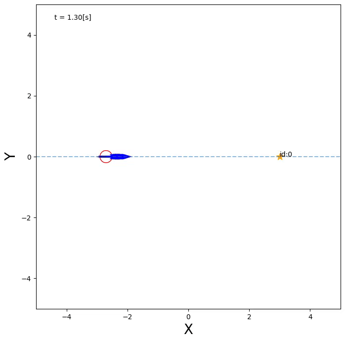

# mcl_line
## 概要
1次元の数直線上を動くロボットにmclを実装したものになります.

## 実行例
ロボットが動くと数直線上にパーティクルが広がり, ランドマークを観測すると狭まります. \
(赤色の円: ロボット, 青色の矢印: パーティクル, 黄色の星: ランドマーク)


## 実行手順
1) ターミナル上でインストールしたいディレクトリに移動
2) インストール
```
git clone https://github.com/kokiikeda6/mcl_line.git
```
3) 実行
```
cd mcl
./mcl_line.py
```
## 動作確認済み環境
* Python 3.8.10
* Ubuntu 20.04

## 参考
* 上田隆一『詳解 確率ロボティクス Pythonによる基礎アルゴリズムの実装』講談社, 2019年.